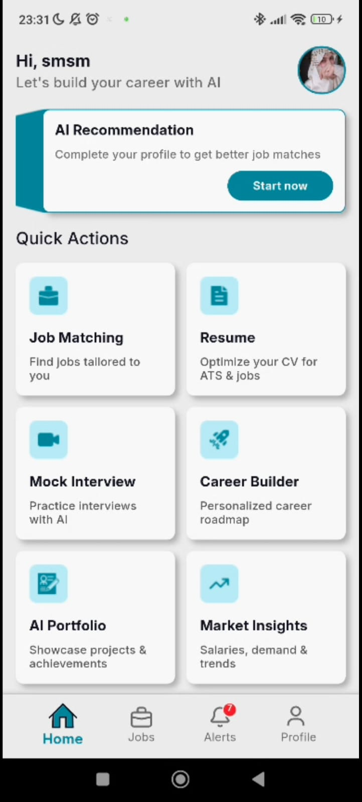
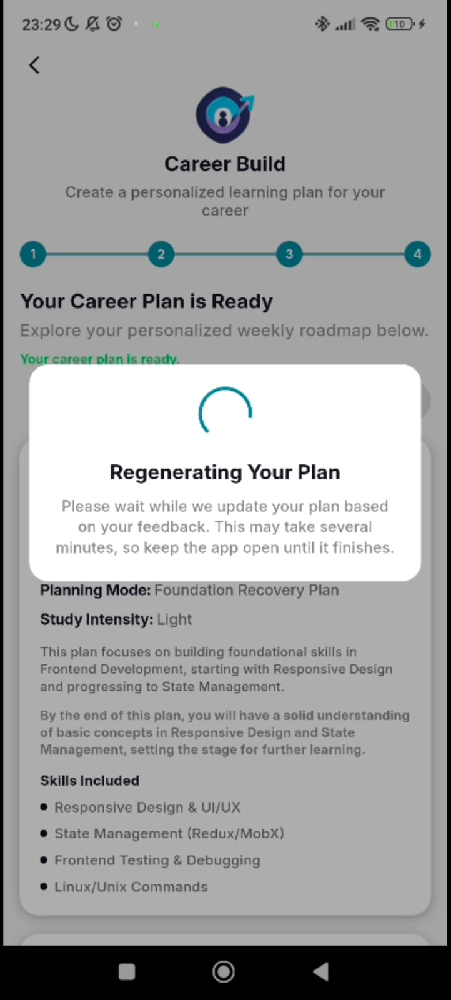
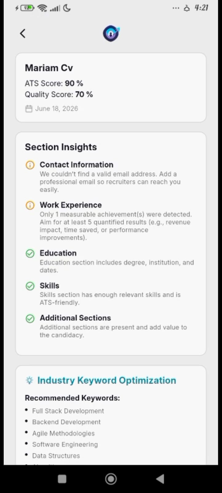
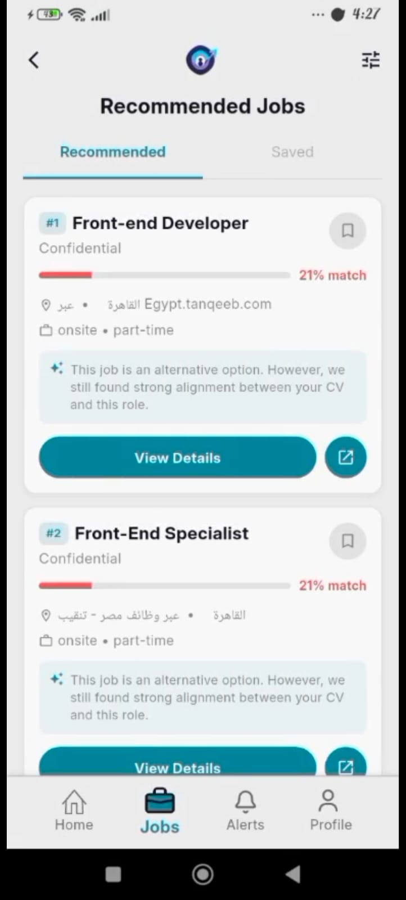
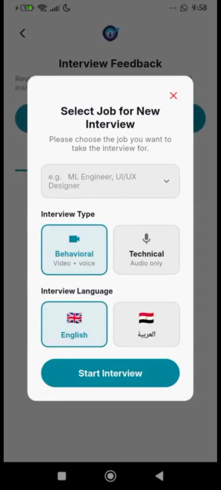
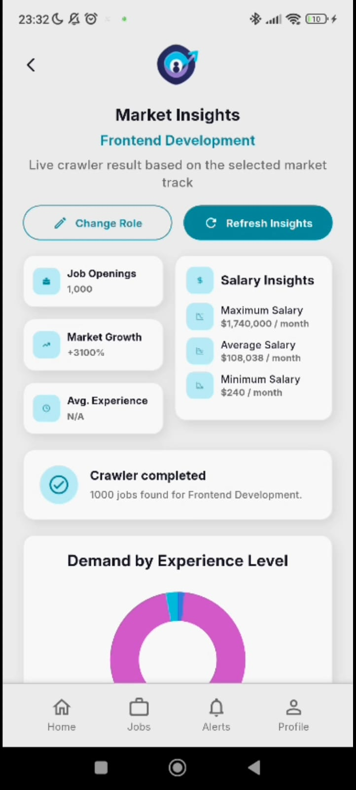
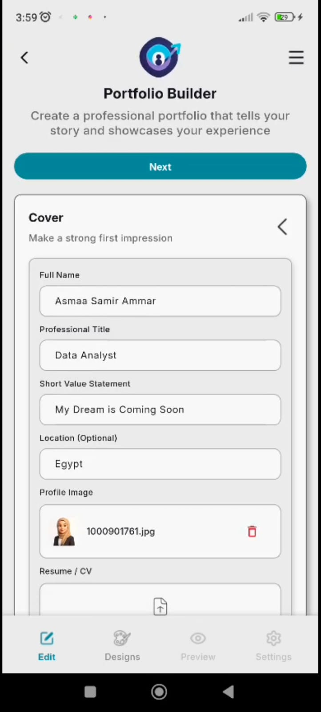

# 🚀 Growza – AI-Powered Career Development Platform

Growza is an AI-powered career development platform designed to bridge the gap between users' current skill sets and their target career paths through personalized recommendations, intelligent analysis, and AI-driven learning.

The platform combines multiple AI-powered services into one ecosystem, helping users optimize their CVs, discover relevant jobs, prepare for interviews, build professional portfolios, and follow personalized learning roadmaps.

> ## 📌 Academic Project
>
> This repository contains the backend implementation of **Growza**, our Graduation Project developed at the **Faculty of Computers and Data Science, Alexandria University**.
>
> Sensitive information such as API keys, environment variables, and credentials has been removed for security purposes.

---

# ✨ Features

## 🤖 AI Career Builder

- Personalized career roadmaps
- Skill gap analysis
- AI-generated weekly learning plans
- Learning timeline estimation
- Roadmap regeneration based on user feedback
- Progress tracking

## 📄 CV Analyzer

- CV parsing
- Technical skill extraction
- ATS optimization
- Skill proficiency estimation

## 💼 Hybrid Job Matching

- Semantic skill matching
- Rule-based recommendation engine
- Personalized job recommendations

## 🎤 AI Mock Interview

- Technical interview simulation
- Behavioral interview simulation
- AI-generated interview feedback

## 📊 Market Insights

- Salary analytics
- Labor market trends
- Career demand analysis

## 🌐 AI Portfolio Builder

- No-code portfolio creation
- Professional portfolio publishing

---

# 🏗️ Tech Stack

### Backend

- Python
- FastAPI
- PostgreSQL
- SQLAlchemy
- Supabase
- Redis
- Celery

### Artificial Intelligence

- Google Gemini
- Groq (Llama 3.3)
- NLP
- Semantic Search
- Embedding Models
- AI Recommendation System

### Cloud & Storage

- Azure Blob Storage
- Cloudinary

### Frontend

- Flutter

---

# ⚙️ System Architecture

```text
Flutter App
      │
      ▼
 FastAPI Backend
      │
 ├── Authentication
 ├── Career Builder
 ├── CV Analyzer
 ├── Job Matching
 ├── Mock Interview
 ├── Portfolio Builder
 ├── Market Insights
      │
      ▼
 PostgreSQL + Supabase
      │
      ▼
 Gemini / Groq APIs
```

---

# 👩‍💻 My Contribution

As the Backend Developer for the **Career Builder** module, I was responsible for designing and implementing:

- CV analysis pipeline
- Technical skill extraction
- Semantic skill matching
- Skill gap analysis
- Learning timeline estimation
- AI-powered roadmap generation
- Personalized recommendation logic
- Feedback-driven roadmap regeneration
- Progress persistence and tracking
- Backend REST APIs
- Database design and integration

Additionally, I contributed to designing the recommendation strategy for the **Hybrid Job Matching** module.

---

# 📸 Project Preview

## 🏠 Home



## 🤖 Career Builder



## 📄 CV Analyzer



## 💼 Job Matching



## 🎤 AI Mock Interview



## 📊 Market Insights



## 🌐 AI Portfolio Builder




# 👥 Team

**Growza Team**

- Shorouq Tareq
- Ola Ragab
- Ranim Moustafa
- Shahd Hossam
- Mariam Mansour
- Nourhan Essam
- Radwa Mohamed
- Asmaa Samir
- Nada Harbi

### Supervisor

**Prof. Dr. Mervat Mikhail**

Faculty of Computers and Data Science  
Alexandria University

Graduation Project – 2026

---

# 📄 Academic Notice

This repository is shared for **educational and portfolio purposes only**.

Please do **not** copy, redistribute, or submit this work as your own academic project.

If you wish to reference or build upon this project, please provide appropriate attribution to the original authors.

© 2026 Growza Team. All Rights Reserved.
